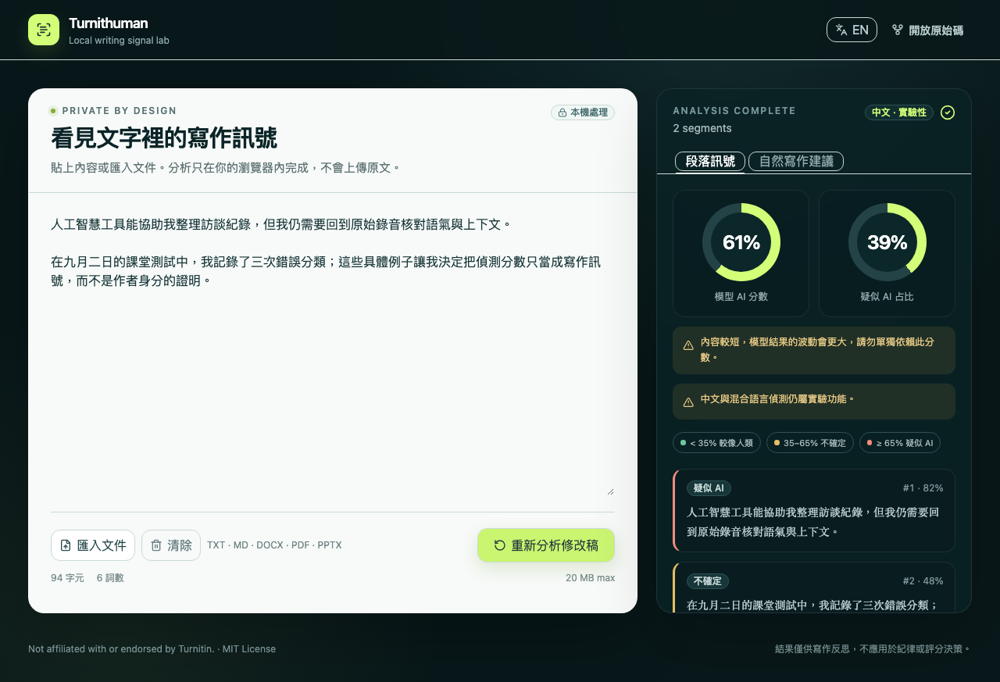

# Turnithuman

[English](README.md) · 繁體中文

[](https://github.com/jacbus1/Turnithuman/actions/workflows/pages.yml)

開源、免費、完全在瀏覽器內執行的多語 AI 寫作訊號檢測器。貼上文字或匯入文件後，內容不會上傳到 Turnithuman 的伺服器，也不需要 API key。

**Turnithuman 不是 Turnitin，亦未獲 Turnitin 聯盟或背書。** 結果不能證明作者身分，也不應作為抄襲、學術不誠實、評分或紀律處分的唯一依據。

[線上使用](https://jacbus1.github.io/Turnithuman/) · [Figma 可編輯設計](https://www.figma.com/design/U4hf2OKjWQy1gHVjgKwsfi)



## 功能

- React、TypeScript、Vite、Web Worker；推論期間介面維持可操作。
- 使用 [`mujian2026/multilingual-ai-text-detector`](https://huggingface.co/mujian2026/multilingual-ai-text-detector) 的 q4 ONNX 版本與 Transformers.js。
- 首次使用約下載 181 MB 模型及 17 MB tokenizer，另需網站與執行環境資源；之後可由瀏覽器快取。
- 英文為主要支援；繁體／簡體中文及混合語言標示為實驗性。
- 支援貼上文字，以及 TXT、MD、DOCX、文字型 PDF、PPTX（單檔 50 MB）。
- 實際檔案限制為 50 MiB；分析文字另限 20–100,000 字元。檔案未超限不代表全文一定可分析。
- 顯示逐段機率、分類、警告與只針對可讀性／個人表達的手動編輯建議。
- 不自動「洗稿」，不承諾降低任何第三方偵測分數。

## 指標

- `modelAiScore`：各段模型 AI 分數按有效 token 權重平均。
- `estimatedAiShare`：分數至少 0.65 的有效文字占比。
- 分類門檻：`< 0.35` 較像人類、`>= 0.35 且 < 0.65` 不確定、`>= 0.65` 疑似 AI。

目前以啟發式估算 token，並非模型 tokenizer 的精確數量；推論會截斷至 384 tokens，長文或特殊字串可能有部分內容未被模型讀取。

門檻是本產品的啟發式設定，未經 Turnitin 校準。模型分數是篩檢訊號，不是經校準的作者機率。英文少於 100 words，或中文／混合內容少於 300 characters 時會顯示低可信度警告。

Turnitin 自身說明其模型可能誤判，且不應單獨用於不利處置；[NAACL 2025 的獨立評估](https://aclanthology.org/2025.findings-naacl.271/)亦顯示偵測器面對未見模型、領域與改寫時可能大幅失準。詳見 [Turnitin AI Writing Report 說明](https://guides.turnitin.com/hc/en-us/articles/22774058814093-Using-the-AI-Writing-Report)。

## 文件處理與隱私

- DOCX：Mammoth 抽取純文字。
- PDF：PDF.js 逐頁抽取文字層；掃描或無文字層 PDF 會明確拒絕。
- PPTX：JSZip 依投影片檔名數字排序抽取文字；經重排的簡報可能與實際播放順序不同。
- 所有內容以 React 純文字節點呈現，不執行文件內 HTML 或腳本。
- 重新整理後不保留原文；網路請求只用於網站資源及公開模型檔案。

完整說明見 [PRIVACY.md](PRIVACY.md) 與 [THIRD_PARTY_NOTICES.md](THIRD_PARTY_NOTICES.md)。

## 本機開發

需求：Node.js 22 以上。

```bash
npm install
npm run dev
```

Vite base path 固定為 `/Turnithuman/`。本機網址通常是 `http://localhost:5173/Turnithuman/`。

```bash
npm run lint
npm run type-check
npm run test
npx playwright install chromium-headless-shell
npm run test:e2e
npm run build
```

CI 不下載大型模型。發布前可選擇執行真實模型 smoke test：

```bash
npm run test:model
```

## 模型限制

模型卡報告的上游評估只涵蓋小型、同領域的英文、簡體中文與越南文資料，AI 範例主要來自 Qwen2.5-1.5B-Instruct。對其他模型、翻譯、改寫、較新生成器、專業領域與繁體中文的表現未獲建立。短文、條列、詩歌、程式碼與高度編輯內容尤其不可靠。

發布前 sanity check 使用 HC3 的 5 組真人／AI 問答時得到 10/10 門檻分類，但對 5 段公版英文文學作品只把 1 段判為「較像人類」，其餘 4 段誤判為「疑似 AI」。這不是正式準確率評估，而是刻意保留的反例：模型在訓練領域內可能看似準確，換到文學或其他領域便可能嚴重失準。

上述 HC3 樣本來自 training split，與上游訓練資料相關，未排除重疊；公版書籍抽取亦包含前言及章節提要。測試使用直接截斷的模型呼叫，未走完整文件分析流程，也未在倉庫保存固定樣本與完整輸出，因此不可當成獨立準確率證明。

## License

程式碼以 [MIT License](LICENSE) 發布。第三方模型與函式庫保留各自授權與署名。
